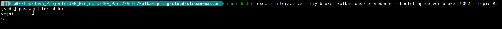

# Activity 6 

### 1. Start zookeeper server

### 2. Start kafka server

### 3. Create a test consumer topic

### 4. Create a test producer topic

### 5. Launch the app

### 6. Start zookeeper server & kafka server using docker-compose
#### . Create a test consumer topic R2

#### . Create a test producer topic R2

##### . Create a test consumer topic R66

#### . Show list of topics

### 7. Create a test consumer topic R333

### 8. Analytics

### 9. Graph

